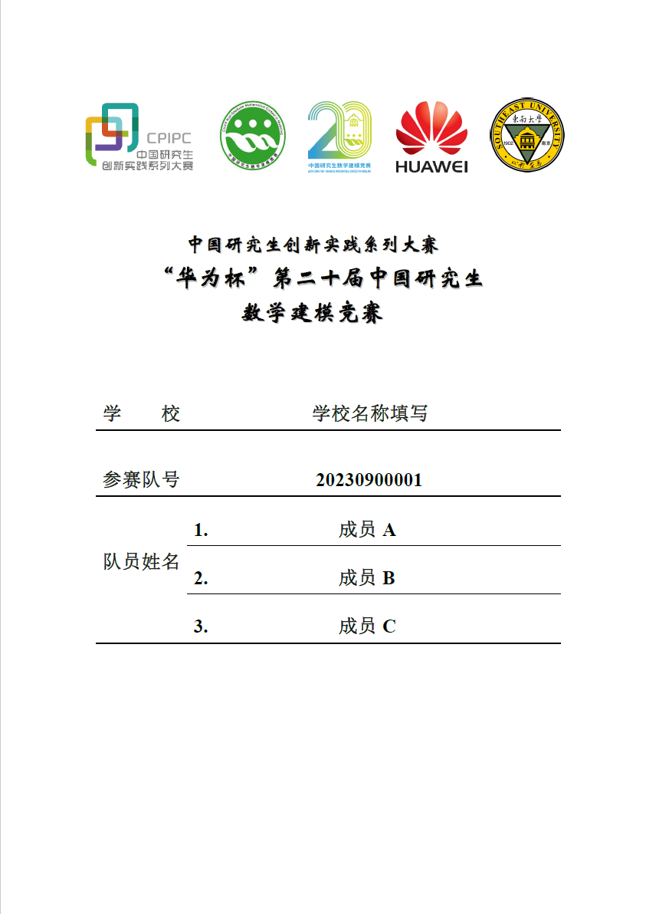
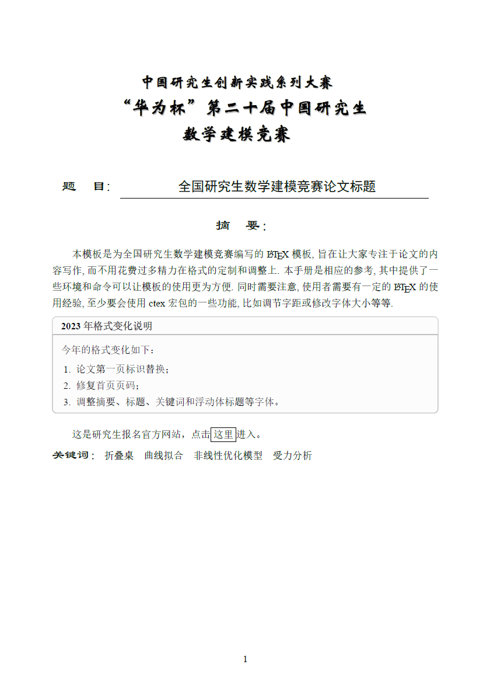

## 2022 全国研究生数学建模竞赛 LaTeX 论文模板

GMCMthesis 是为全国研究生数学建模竞赛编写的 LaTeX 模板, 旨在让大家专注于论文的内容写作, 而不用花费过多精力在格式的定制和调整上. 本手册是相应的参考, 其中提供了一些环境和命令可以让模板的使用更为方便. 同时需要注意, 使用者需要有一定的 LaTeX 的使用经验, 至少要会使用 ctex 宏包的一些功能, 比如调节字距或修改字体大小等等.

## 更新记录

2021 年 10 月更新：

1. 更新封面格式；

2. 更新了内容和字体。
 
2022 年 10 月更新：

1. 更新了 Logo 和标题；

2. 修复了几个小 bug。
